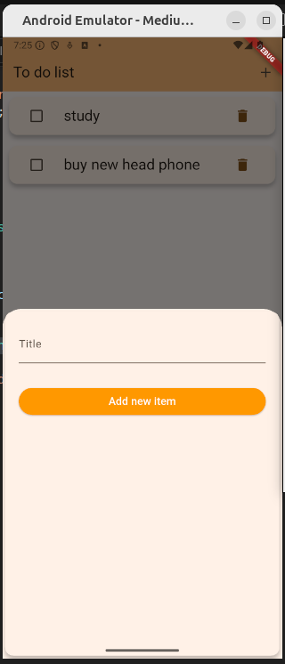

# to_do_app

This is a To Do List project developed with Flutter, built to practice and strengthen my knowledge in mobile development and unit testing.

# About the Project

The To Do List app allows users to:

    - Add new tasks.

    - Mark tasks as completed.

    - Delete tasks.

    - Automatically sort tasks so that unfinished tasks appear first.

This project was designed as a hands-on exercise with Flutter, focusing on UI development, state management, and unit testing to ensure feature reliability.

## Getting Started

This project is a starting point for a Flutter application.

A few resources to get you started if this is your first Flutter project:

- [Lab: Write your first Flutter app](https://docs.flutter.dev/get-started/codelab)
- [Cookbook: Useful Flutter samples](https://docs.flutter.dev/cookbook)

For help getting started with Flutter development, view the
[online documentation](https://docs.flutter.dev/), which offers tutorials,
samples, guidance on mobile development, and a full API reference.

